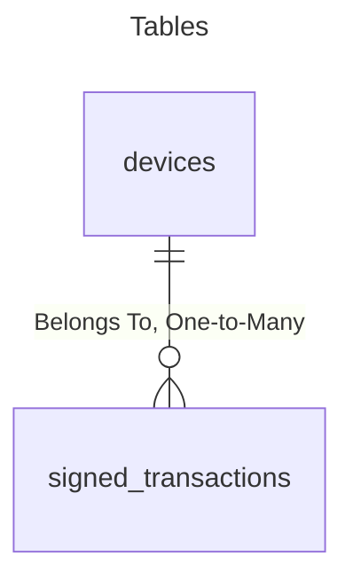

# SSCCG Backend Challenge
REST API service that allows customers to create `signature devices` with which they can sign arbitrary transaction data.

## Architecture

The application is written in Golang and uses In Memory maps as database.

### API endpoints
- `GET /api/v1/health` - Returns the health of the service.
- `GET /api/v1/devices` - Returns all the devices.
- `POST /api/v1/devices` - Creates a new device.
- `GET /api/v1/device/{id}` - Returns the device with the given id.
- `POST /api/v1/device/{id}/signatures` - Signs the given transaction with the device with the given id.
- `GET /api/v1/device/{id}/signatures` - Returns all the signatures of the device with the given id.

The API is documented in OpenAPI 3.0 standards.
[API Documentation](/openapi.yaml)

### Database schema

### HTTP Server
- The entrypoint is in `main.go`

## Development

### Environment variables
Optional environment variable:
- `SERVER_PORT` - The port where the HTTP server will listen. Default: `8080`

### Build process
- Type `make build` to generate the binaries in the `build` folder.

### Testing
#### Unit tests:
- Type `make unit-test` to execute it.

#### Tests coverage:
- Type `make coverage-report` to generate an HTML report with the tests coverage.
- Type `make coverage-total` to check the total tests coverage.
